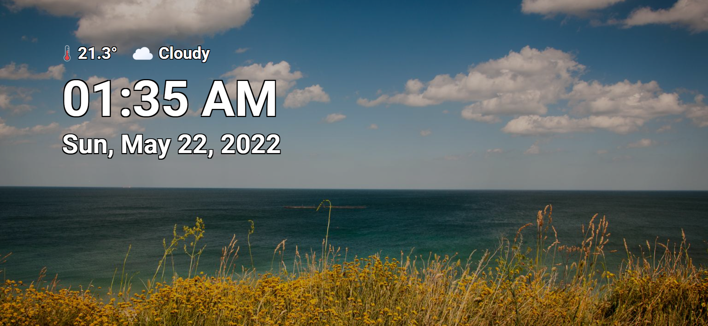
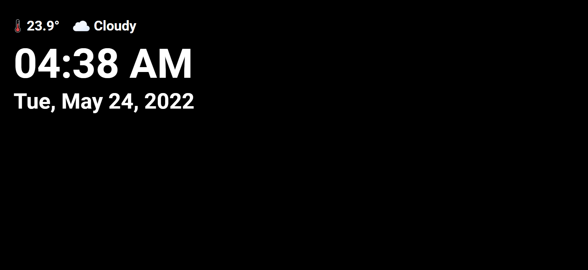
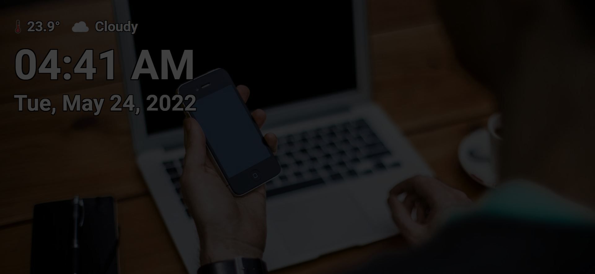

# [DEPRECATED] Lovelace Wallpanel Screensaver
[](https://github.com/hacs/integration)

[](https://github.com/Shreyas-R/lovelace-wallpanel-screensaver/blob/main/LICENSE)
[](https://github.com/Shreyas-R/lovelace-wallpanel-screensaver/stargazers)

[](https://github.com/Shreyas-R/lovelace-wallpanel-screensaver/issues)

Wall panel mode for your Home Assistant Lovelace dashboard with more focus on screensaver. Configurable extension which features a fullscreen kiosk mode, image and weather-clock screensaver, screen wake lock and the ability to hide side and top bar.




## DEPRECATION NOTICE
This HA frontend plugin has been deprecated for following reasons,
1. I'm not getting enough time to work on this project.
2. The development of [original repo](https://github.com/j-a-n/lovelace-wallpanel) (from which this repo was forked from) has been resumed by the main developer with similar and better implementation of features.

## Installation and Upgrade

<details>
<summary>HACS</summary>

### ~~HACS Default~~
1. ~~Install [HACS](https://hacs.xyz).~~
2. ~~Go to `HACS` => `Frontend` and click on `EXPLORE & DOWNLOAD REPOSITORIES` button.~~
3. ~~Search `Lovelace Wallpanel Screensaver` on opened `Add repository` dialog.~~
4. ~~Select the version you want to install (latest preferred).~~
5. ~~Click on install button.~~
6. ~~Reload the webpage in your browser.~~

### ~~HACS Custom~~
1. ~~Install [HACS](https://hacs.xyz).~~
2. ~~Go to `HACS` => `Frontend`.~~
3. ~~Click on the 3 dots in the top right corner.~~
4. ~~Select `Custom repositories`.~~
5. ~~Copy and add the [URL of this repository](https://github.com/Shreyas-R/lovelace-wallpanel-screensaver) in `repository` text edit field.~~
6. ~~Select the correct category: `Lovelace`.~~
7. ~~Click the "ADD" button.~~
8. ~~Reload the webpage in your browser.~~
</details>

<details>
<summary>Manual</summary>

### Installation
1. Download latest `lovelace-wallpanel-screensaver.zip` from [releases](https://github.com/Shreyas-R/lovelace-wallpanel-screensaver/releases) and extract it into the folder **config/www/lovelace-wallpanel-screensaver/**. <br>`or`<br> Download the contents of [dist](https://github.com/Shreyas-R/lovelace-wallpanel-screensaver/tree/main/dist) directory and place them into the folder **config/www/lovelace-wallpanel-screensaver/**.
2. Open Home Assistant Configuration => Lovelace Dashboards => Resources and add **/local/lovelace-wallpanel-screensaver/wallpanel-screensaver.js** (Resource type: **JavaScript module**).

### Upgrade
1. Download latest `lovelace-wallpanel-screensaver.zip` from [releases](https://github.com/Shreyas-R/lovelace-wallpanel-screensaver/releases) and extract it into the folder **config/www/lovelace-wallpanel-screensaver/**. <br>`or`<br> Download the contents of [dist](https://github.com/Shreyas-R/lovelace-wallpanel-screensaver/tree/main/dist) directory and place them into the folder **config/www/lovelace-wallpanel-screensaver/**.
2. Open Home Assistant Configuration => Lovelace Dashboards => Resources and modify the resource URL to force browsers to reload the resource.
For example, you could add or change the query string: **/local/lovelace-wallpanel-screensaver/wallpanel-screensaver.js?v2**

```
  config
    └── ...
    └── configuration.yaml
    └── www
        └── lovelace-wallpanel-screensaver
            └── wallpanel-screensaver.js
            └── weather-icons
```
</details>

## Setup
<details>
<summary>Lovelace Dashboard YAML</summary>

### Lovelace Dashboard YAML<a name="lovelace_dashboard_yaml"></a>

You can add the configuration in the format given [below](#default_config) to your lovelace dashboard configuration yaml file (at the top of raw config). 
- Make sure `enabled: true` is set if you want the wallpanel-screensaver to work by default for a dashboard.
- If you want to enable the wallpanel-screensaver for a dashboard displayed on a specific browser or device, then that is also possible. Refer `"URL Query Parameters"` [section below](#url_query_parameters) for details.

#### Default Config<a name="default_config"></a>:
```yaml
wallpanel_screensaver:
  enabled: false
  debug: false
  hide_toolbar: false
  hide_sidebar: false
  fullscreen: false
  idle_time: 15
  fade_in_time: 3.0
  crossfade_time: 3.0
  display_time: 15.0
  screensaver_tint: 25
  display_tint: 0
  keep_screen_on_time: 0
  black_screen_after_time: 0
  weather_entity: "weather.home"
  image_url: 'http://unsplash.it/${width}/${height}?random=${timestamp}'
  image_fit: cover
  info_update_interval: 30
  info_position_update_interval: 30
  info_position_crossfade_time: 3.0
  style:
    wallpanel-screensaver-info-date:
      font-size: 8vh
      font-weight: 600
      color: '#ffffff'
      text-shadow: '-2px -2px 0 #000000, 2px -2px 0 #000000, -2px 2px 0 #000000, 2px 2px 0 #000000'
    wallpanel-screensaver-info-time:
      font-size: 15vh
      font-weight: 1200
      color: '#ffffff'
      text-shadow: '-2.5px -2.5px 0 #000000, 2.5px -2.5px 0 #000000, -2.5px 2.5px 0 #000000, 2.5px 2.5px 0 #000000'
    wallpanel-screensaver-info-weather:
      font-size: 5vh
      font-weight: 400
      color: '#ffffff'
      text-shadow: '-1.5px -1.5px 0 #000000, 1.5px -1.5px 0 #000000, -1.5px 1.5px 0 #000000, 1.5px 1.5px 0 #000000'
      display: 'inline'
      vertical-align: 'top'
      position: 'relative'
      left: -36px
    weather-temperature-icon:
      width: 64px
      height: 64px
      vertical-align: 'middle'
      position: 'relative'
      left: 12px
    weather-state-icon:
      width: 64px
      height: 64px
      vertical-align: 'middle'
  info_template: '
    <div id="wallpanel-screensaver-info-weather">
		  <table>
		  	<tr>
		  		<th></th>
 		  		<th>{{ states[config.weather_entity].attributes.temperature }}°&ensp;</th>
 		  		<th></th>
  				<th>{{ states[config.weather_entity].state.replace(/(^|\s)[A-Za-zÀ-ÖØ-öø-ÿ]/g, c => c.toUpperCase()) }}</th>
			  </tr>
		  </table>
 	  </div>
	  <div id="wallpanel-screensaver-info-time">{{ (new Date()).toLocaleTimeString(undefined, {hour: "2-digit", minute:"2-digit", hour12: config.hour_12}) }}</div>
	  <div id="wallpanel-screensaver-info-date">{{ (new Date()).toLocaleDateString(undefined, {weekday: "short", year: "numeric", month: "short", day: "numeric"}) }}</div>'
```
</details>

<details>
<summary>URL Query Parameters</summary>

### URL Query Parameters<a name="url_query_parameters"></a>

It is also possible to pass configuration parameters in the query string.
These parameters (**wpss_\<parameter\>**) will override the corresponding properties in the yaml configuration.
This will allow you to use browser or device specific settings.
Use JSON syntax for the values.

**Example**:
`http://hass:8123/lovelace/default_view?wpss_hide_sidebar=false&wpss_idle_time=60&wpss_style={"wallpanel-screensaver-info-date":{"font-size":"10vh"}}`

#### Activate on individual devices only
1. Set enabled to **false** in your dashboard configuration.
```yaml
wallpanel_screensaver:
  enabled: false
```
2. Add a query string to the URL to activate on a device:
`http://hass:8123/lovelace/default_view?wpss_enabled=true`
</details>

## Configuration

<details>
<summary>Configuration Parameters</summary>

### Configuration Parameters
You can set the following configuration parameters for every individual lovelace dashboard:
<br><br>

| Parameter | Description | Data Type | Default |
| --------- | ----------- | --------- | ------- |
| enabled                 | Enable wallpanel-screensaver? <br>*You will need to set this to **true** to activate the wallpanel-screensaver for the dashboard.* | Boolean | false   |
| debug                   | Show debug output.                                                                       | Boolean | false   |
| hide_toolbar            | Hide the upper panel toolbar.                                                             | Boolean | false   |
| hide_sidebar            | Hide the navigation sidebar.                                                              | Boolean | false   |
| fullscreen              | Set browser window to fullscreen? <br>*Due to browser restrictions you will need to interact with the screen once to activate fullscreen mode after loading the dashboard page.* | Boolean |false   |
| idle_time               | Time in seconds after which the screensaver will start (0 = screensaver disabled).        | Number (Integer/Float) | 15.0      |
| fade_in_time            | Screensaver fade-in time in seconds.                                                      | Number (Integer/Float) | 3.0     |
| crossfade_time          | Crossfade duration in seconds for screensaver images.                                     | Number (Integer/Float) | 3.0     |
| display_time            | Duration in seconds after which the next screensaver image will be shown.                 | Number (Integer/Float) | 15.0    |
| screensaver_tint        | Tint the screensaver on a scale of 0 (transparent) - 100 (Opaque). Useful for adjusting the visibily of information box views from a distance. | Number (Integer) | 25   |
| display_tint            | Tint the display on a scale of 0 (transparent) - 100 (Opaque) when screensaver is active. | Number (Integer) | 0       | 
| keep_screen_on_time     | Time in seconds for how long to prevent screen to dim or lock (0 = disabled). <br>*Due to browser restrictions you will need to interact with the screen once to activate screen wake lock after loading the dashboard page.* | Number (Integer/Float) | 0       |
| black_screen_after_time | Time in seconds after which the screensaver will show just a black screen (0 = disabled). | Number (Integer/Float) | 0       |
| hour_12          | The flag which sets the time format as follows, <br>• true: 12-hour format <br>• false: 24-hour format <br>• undefined or null: Locale default format  | Boolean | null |
| weather_entity          | Pass the weather entity if home name is not default (Home) in your Home Assistant setup (Pass empty string to disable the default weather info view).  | String | weather.home |
| image_url               | Fetch screensaver images from this URL (Pass empty string to disable photo screensaver and instead have a black screen screensaver). See [below](#url_for_images) for details. | String | See [below](#url_for_images) |
| image_fit               | Value to be used for the CSS-property 'object-fit' of the images (possible values are: cover / contain / fill / ...). |   String |  cover |
| info_update_interval    | Update interval for the information on the screen (0 = disabled or hidden).            | Number (Integer/Float) | 30.0     |
| info_position_update_interval | Time interval in seconds at which information box position will be randomly changed on the screensaver screen to avoid screen burn issue on always-on screens (0 = disabled). | Number (Integer/Float) | 30.0     |
| info_position_crossfade_time          | Info box position crossfade duration in seconds.                                  | Number (Integer/Float)  | 3.0     |
|	style                   | Additional CSS styles for wallpanel-screensaver elements. See [below](#info_style_config) for details.                                 | Dictionary | See [below](#info_style_config)      |
| night_mode | Configuration of wallpanel-screensaver to be used during night time. See [below](#night_mode_config) for details. | Dictionary | {}      |
| info_template           | Info box content HTML template. See [below](#info_template_config) for details.                                    | String | See [below](#info_template_config) |
</details>

<details>
<summary>Setting URL for Images</summary>

### Setting URL for Images<a name="url_for_images"></a> 
Screensaver images will be fetched from the URL passed under `image_url` parameter.
This can be any HTTP URL or a Home Assistant media-source URL.

The following variables can be used in supported HTTP URLs to fetch random images:
- `${timestamp}` = current unix timestamp
- `${width}` = viewport width
- `${height}` = viewport height

#### Tested URLs:
##### 1. unsplash.it or picsum.photos HTTP URL (Default)
```yaml
wallpanel_screensaver:
  ...
  image_url: 'http://unsplash.it/${width}/${height}?random=${timestamp}' 
```
or<br>
```yaml
wallpanel_screensaver:
  ...
  image_url: 'http://picsum.photos/${width}/${height}?random=${timestamp}' 
```
Refer https://picsum.photos/ for advanced configuration like grayscale and blurred images.

##### 2. Home Assistant media-source URL
Just set the `image_url` to a media-source URL as displayed in the URL of the Home Assistant Media Browser.
See [Home Assistant Media Source integration documentation](https://www.home-assistant.io/integrations/media_source) for details.

- `media-source://media_source` = Images in all Local Media sources
- `media-source://media_source/media1` = Images in the Local Media directory named `media1`
- `media-source://media_source/media1/folder1` = Images in `folder1` of the Local Media directory named `media1`

Instead of using `media-source://media_source/media1/folder1` as `image_url` you can just use `/media1/folder1` as a shortcut.

```yaml
wallpanel_screensaver:
  ...
  image_url: 'media-source://media_source/media1/folder1' 
```
or<br>
```yaml
wallpanel_screensaver:
  ...
  image_url: '/media1/folder1' 
```
</details>

<details>
<summary>Configuration of Night Mode</summary>

### Configuration of Night Mode<a name="night_mode_config"></a> 
If you want to have a different configuration for wallpanel-screensaver at night time then it is possible to configure the following parameters under `night_mode` parameter:
<br><br>

| Parameter | Description | Requirement | Data Type | Example |
| --------- | ----------- | ----------- | --------- | ------- |
| start_time | Time in 'HH:mm' string format at which Night Mode config is activated. | Mandatory | String | '23:00' |
| end_time | Time in 'HH:mm' string format at which Night Mode config is de-activated. | Mandatory | String | '6:00' |
| idle_time | Time in seconds after which the screensaver will start (0 = screensaver disabled). | Optional | Number (Integer/Float) | 15.0 |
| fade_in_time | Screensaver fade-in time in seconds. | Optional | Number (Integer/Float) | 3.0 |
| crossfade_time | Crossfade duration in seconds for screensaver images. | Optional | Number (Integer/Float) | 3.0 |
| display_time | Duration in seconds after which the next screensaver image will be shown. | Optional | Number (Integer/Float) | 15.0 |
| screensaver_tint | Tint the screensaver on a scale of 0 (transparent) - 100 (Opaque). Useful for adjusting the visibily of information box views from a distance. | Optional | Number (Integer) | 25 |
| display_tint | Tint the display on a scale of 0 (transparent) - 100 (Opaque) when screensaver is active. | Optional | Number (Integer) | 0 | 
| keep_screen_on_time | Time in seconds for how long to prevent screen to dim or lock (0 = disabled). <br>*Due to browser restrictions you will need to interact with the screen once to activate screen wake lock after loading the dashboard page.* | Optional | Number (Integer/Float) | 0 |
| black_screen_after_time | Time in seconds after which the screensaver will show just a black screen (0 = disabled). | Optional | Number (Integer/Float) | 0 |
| image_url | Fetch screensaver images from this URL (Pass empty string to disable photo screensaver and instead have a black screen screensaver). See [above](#url_for_images) for details. | Optional | String | See [above](#url_for_images) |
| info_update_interval | Update interval for the information on the screen (0 = disabled or hidden). | Optional | Number (Integer/Float) | 30.0 |
| info_position_update_interval | Time interval in seconds at which information box position will be randomly changed on the screensaver screen to avoid screen burn issue on always-on screens (0 = disabled). | Optional | Number (Integer/Float) | 30.0 |
| info_position_crossfade_time | Info box position crossfade duration in seconds. | Optional | Number (Integer/Float)  | 3.0 |
| style | Additional CSS styles for wallpanel-screensaver elements. See [below](#info_style_config) for details. | Optional | Dictionary | See [below](#info_style_config) |
| info_template | Info box content HTML template. See [below](#info_template_config) for details. | Optional | String | See [below](#info_template_config) |

#### Example:
The following example dims the display, disables photo screensaver and reduces screensaver start time between 23:00 to 05:00 everyday. 
```yaml
wallpanel_screensaver:
  enabled: true
  idle_time: 60
  ...
  night_mode:
    start_time: '23:00'
    end_time: '05:00'
    idle_time: 15
    display_tint: 75
    image_url: ''
```
</details>

<details>
<summary>Styling Info Box Elements</summary>

### Styling Info Box Elements<a name="info_style_config"></a>
The wallpanel-screensaver HTML elements can be styled as per CSS stylesheet language. The main element `wallpanel-screensaver-info-box` and all of it's contents (information elements) can be styled under `style` parameter. 

<br>

The default value of the `style` parameter is:
```yaml
wallpanel-screensaver-info-date:
  font-size: 8vh
  font-weight: 600
  color: '#ffffff'
  text-shadow: '-2px -2px 0 #000000, 2px -2px 0 #000000, -2px 2px 0 #000000, 2px 2px 0 #000000'
wallpanel-screensaver-info-time:
  font-size: 15vh
  font-weight: 1200
  color: '#ffffff'
  text-shadow: '-2.5px -2.5px 0 #000000, 2.5px -2.5px 0 #000000, -2.5px 2.5px 0 #000000, 2.5px 2.5px 0 #000000'
wallpanel-screensaver-info-weather:
  font-size: 5vh
  font-weight: 400
  color: '#ffffff'
  text-shadow: '-1.5px -1.5px 0 #000000, 1.5px -1.5px 0 #000000, -1.5px 1.5px 0 #000000, 1.5px 1.5px 0 #000000'
  display: 'inline'
  vertical-align: 'top'
  position: 'relative'
  left: -36px
weather-temperature-icon:
  width: 64px
  height: 64px
  vertical-align: 'middle'
  position: 'relative'
  left: 12px
weather-state-icon:
  width: 64px
  height: 64px
  vertical-align: 'middle'
```
</details>

<details>
<summary>Info Box Templating (Advanced Usage)</summary>

### Info Box Templating (Advanced Usage)<a name="info_template_config"></a> 

The screensaver info box will be built from HTML code in `info_template` parameter.
JavaScript expression in between `{{` `}}` will be evaluated.

The following variables can be used to fetch the dynamic data and resources while the wallpanel-screensaver is running, 
- The local object `states` can be used to access all entity states of the Home Assistant state machine.
- The global object `config` can be used to access currently applied configuration of the wallpanel-screensaver.
- The global string `filesParentPath` can be used to access the path to the folder where the wallpanel-screensaver files are located.

The default value of the `info_template` parameter is:

```yaml
'
<div id="wallpanel-screensaver-info-weather">
  <table>
  	<tr>
  		<th></th>
  		<th>{{ states[config.weather_entity].attributes.temperature }}°&ensp;</th>
  		<th></th>
		<th>{{ states[config.weather_entity].state.replace(/(^|\s)[A-Za-zÀ-ÖØ-öø-ÿ]/g, c => c.toUpperCase()) }}</th>
	  </tr>
  </table>
</div>
<div id="wallpanel-screensaver-info-time">{{ (new Date()).toLocaleTimeString(undefined, {hour: "2-digit", minute:"2-digit", hour12: config.hour_12}) }}</div>
<div id="wallpanel-screensaver-info-date">{{ (new Date()).toLocaleDateString(undefined, {weekday: "short", year: "numeric", month: "short", day: "numeric"}) }}</div>
'
```

The CSS styles of the HTML elements used in `info_template` parameter can also be passed in `style` parameter (Make sure to properly ID the elements that are required to be styled).
</details>

<details>
<summary>Using Icons and Resources (Advanced Usage)</summary>

### Using Icons and Resources (Advanced Usage)<a name="icons_config"></a> 
#### Weather Icons
If you want to replace existing weather icons or want to use additional weather icons based on different weather providers on Home Assistant then you can replace or add additional icons at the following location,
```
  config
    └── ...
    └── configuration.yaml
    └── www
        ...
        └── lovelace-wallpanel-screensaver
            └── wallpanel-screensaver.js
            └── weather-icons <---------- // ADD OR REPLACE INSIDE THIS FOLDER // 
                └── xyz1.svg
                └── xyz2.svg
                └── ...
                    ...
```
<br>

Naming convention used for default weather icons is as follows,
```
{{ weather.entity_name.state }}-sun-{{ sun.sun.state }}.svg
    |                                   |
    |                                   |
    |                                   └─> // This provides day or night info (Eg: above-horizon and below-horizon) // 
    |
    └─> // This provides current weather state (Eg: cloudy, lightning-rainy, snowy) // 
```
**NOTE:** The cache of the browser or Home Assistant companion app has to cleared and a hard reload or refresh of the dashboard page is required for the replaced weather icons to appear on the wallpanel-screensaver. 
#### Additional Resources (to use in [info_template](#info_template_config))
If you want to use additional resources (like icons, images) in the `info_template` parameter to build a custom info box then you can add additional resources at the following location, 
```
  config
    └── ...
    └── configuration.yaml
    └── www
        ...
        └── lovelace-wallpanel-screensaver <----- // ADD ADDITIONAL RESOURCES INSIDE THIS FOLDER // 
            └── wallpanel-screensaver.js
            └── weather-icons 
                └── xyz1.svg
                └── xyz2.svg
                └── ...
                    ...
```
Once you have added the needed resource files in the wallpanel-screensaver files directory, you can access the resources using `filesParentPath` variable in the `info_template` parameter.
##### Example:
Additional Resources Path:
```
  config
    └── ...
    └── configuration.yaml
    └── www
        ...
        └── lovelace-wallpanel-screensaver  
            └── wallpanel-screensaver.js
            └── ...
            └── my-photos <----- // ADDITIONAL RESOURCES FOLDER ADDED HERE //
                └── my-photo-1.png
                └── ...
                    ...
```
Dashboard YAML Config:
```yaml
wallpanel_screensaver:
  ...
  info_template: ''
```
**NOTE:** The cache of the browser or Home Assistant companion app has to cleared and a hard reload or refresh of the dashboard page is required for the replaced resources to appear on the wallpanel-screensaver.
</details>

## Usage Examples
<details>
<summary>View Examples</summary>

### 1. Default screensaver (with default config)
```yaml
wallpanel_screensaver:
  enabled: true
  weather_entity: "weather.mansion"
```


### 2. Black weather-clock screensaver
```yaml
wallpanel_screensaver:
  enabled: true
  idle_time: 10
  weather_entity: "weather.mansion"
  image_url: ''
  info_update_interval: 30
```


### 3. Photos only screensaver
```yaml
wallpanel_screensaver:
  enabled: true
  idle_time: 10
  info_update_interval: 0
  screensaver_tint: 0
```


### 4. Dim or tinted display screensaver
```yaml
wallpanel_screensaver:
  enabled: true
  idle_time: 10
  weather_entity: "weather.mansion"
  screensaver_tint: 25
  display_tint: 75
```

</details>

## To-do List
<details>
<summary>View List</summary>
<br>

- [x] Night Mode
- [x] Weather Icons
- [ ] HA sensor based control
- [x] Local storage images access
- [ ] Network storage images access (HTTP, FTP, ...)
- [ ] Third party photo services (Google Photos, ...)
</details>

# Credits
- This project uses weather icons from https://github.com/basmilius/weather-icons licensed under [MIT license](https://github.com/basmilius/weather-icons/blob/dev/LICENSE).
- This project is forked from
https://github.com/j-a-n/lovelace-wallpanel licensed under [GPL-3.0 license](https://github.com/j-a-n/lovelace-wallpanel/blob/main/LICENSE).
